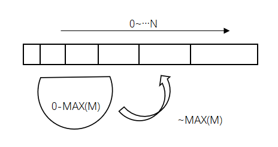

## About ETFFeast

This is a purely decentralized smart contract dividend game, a pure **Solidity** implementation of a solution for all functions, I will describe how it is done.

## Rule description

> Some rules and mode descriptions for the game

### How to join

Join the game with **ETH** + **TOKEN**.
* > ETH is the amount of investment, TOKEN is used to join the credentials, it is burned.
* > Please settle before **re-investment**.

1-11 -> **junior**, 12-~ -> **senior**

### ETH distribution
|Game                          |Token                         |
|-------------------------------|-----------------------------|
|0.3%~2% - Floating dividend/day								|34% - game|
|Get static different ratio returns by recommended floor					|25% - extreme|
|5% - Crown of ETH							|16% -  community/partner|
|6% - game ecological construction							|25% - lucky prize|
|2% - superior	for creation(subordinate)						|/|
|6% - superior and equal(subordinate)					|/|

### Game contract rules
* #### Static dividend
	* 0.3%~2%/day of investment.
	* Please settle before **re-investment**.
	* When there are multiple investments, dividends only consider the largest investment.
* #### Dynamic income
	* Take static income every day, primary -11 generation (push generations to take several generations); advanced-21 generation.
	
	|Level                          	|Floor limit                | Reward |
	|-------------------------------|-----------------------------|-----------------------------|
	|junior								|True		  |1->50%;2-11->3%|
	|senior								|False	  |1->50%;2-20->3%;21->10%|
	
	
	* Vip level acquisition conditions.
	
	|Vip                          	|Business Line                |
	|-------------------------------|-----------------------------|
	|1								|50 ETH/50 ETH/50 ETH		  |
	|2								|100 ETH/100 ETH/100 ETH	  |
	|3								|300 ETH/300 ETH/300 ETH	  |
	
	* There are 3% difference between Vip (V0-V1, V1-V2, V2-V3), and the level award is 3% (V1-V1, V2-V2, V3-V3) , no exit restrictions.
	* Extreme income, 99 V3s worldwide will receive a 25% weighted reward for the VAT, no restrictions
	* Creation player gets 2% bonus under umbrella, no exit restrictions
	
* #### ETH Crown Award Pool
	* 5% enter the game prize pool, ETH crown will get 20% of the game prize pool, 80% will roll into the next round.
	* The prize pool is 72 hours round.
	* The person who pushes the most in each round will become the crown of ETH and receive the final reward.
	
### Token contract rules
* #### TOKEN
	* Every time TOKEN burns 1 million pieces, the exchange price increases by 25%, such as: 10000-8000-6400-5120-4096-3276-2620-2096-...-1.
	* The corresponding burning ratio will always remain 1/10 of the exchange rate.
	
* #### Lucky prize pool
	* 25% enter the token prize pool, ETH lucky will get 20% of the game prize pool, 80% will roll into the next round.
	* The prize pool is 24 hours round, Each time the game contract is invested in 1 ether, the time increases by 10 minutes.
	* The last investor in each round will receive the final reward.

## Core implementation

### How was the contract born?

For the first time, this contract implements all logical algorithms on the pure chain. For the first time, there is no real human intervention, because many limitations of solidity lead to many problems in writing this contract, in the case of overcoming all difficulties. This contract was issued.

### About the calculation process of some functions

We borrowed **Buffer** to compress the data. Most of our data is compressed into buffers, so my gas is small.

Here is a part of the code that uses the Buffer library ->

```javascript
library Buffer {
    struct buffer {
        bytes buf;
        uint capacity;
    }
    function init(buffer memory buf, uint capacity) internal pure returns(buffer memory) {
        if (capacity % 32 != 0) {
            capacity += 32 - (capacity % 32);
        }
        buf.capacity = capacity;
        assembly {
            let ptr := mload(0x40)
            mstore(buf, ptr)
            mstore(ptr, 0)
            mstore(0x40, add(32, add(ptr, capacity)))
        }
        return buf;
    }
	function write(buffer memory buf, uint off, bytes memory data, uint len) internal pure returns(buffer memory) {
        require(len <= data.length);

        if (off + len > buf.capacity) {
            resize(buf, max(buf.capacity, len + off) * 2);
        }

        uint dest;
        uint src;
        assembly {
            // Memory address of the buffer data
            let bufptr := mload(buf)
            // Length of existing buffer data
            let buflen := mload(bufptr)
            // Start address = buffer address + offset + sizeof(buffer length)
            dest := add(add(bufptr, 32), off)
            // Update buffer length if we're extending it
            if gt(add(len, off), buflen) {
                mstore(bufptr, add(len, off))
            }
            src := add(data, 32)
        }

        // Copy word-length chunks while possible
        for (; len >= 32; len -= 32) {
            assembly {
                mstore(dest, mload(src))
            }
            dest += 32;
            src += 32;
        }

        // Copy remaining bytes
        uint mask = 256 ** (32 - len) - 1;
        assembly {
            let srcpart := and(mload(src), not(mask))
            let destpart := and(mload(dest), mask)
            mstore(dest, or(destpart, srcpart))
        }

        return buf;
    }
    function write(buffer memory buf, uint off, bytes32 data, uint len) private pure returns(buffer memory) {
        if (len + off > buf.capacity) {
            resize(buf, (len + off) * 2);
        }

        uint mask = 256 ** len - 1;
        // Right-align data
        data = data >> (8 * (32 - len));
        assembly {
            // Memory address of the buffer data
            let bufptr := mload(buf)
            // Address = buffer address + sizeof(buffer length) + off + len
            let dest := add(add(bufptr, off), len)
            mstore(dest, or(and(mload(dest), not(mask)), data))
            // Update buffer length if we extended it
            if gt(add(off, len), mload(bufptr)) {
                mstore(bufptr, add(off, len))
            }
        }
        return buf;
    }
    function writeInt(buffer memory buf, uint off, uint data, uint len) private pure returns(buffer memory) {
        if (len + off > buf.capacity) {
            resize(buf, (len + off) * 2);
        }

        uint mask = 256 ** len - 1;
        assembly {
            // Memory address of the buffer data
            let bufptr := mload(buf)
            // Address = buffer address + off + sizeof(buffer length) + len
            let dest := add(add(bufptr, off), len)
            mstore(dest, or(and(mload(dest), not(mask)), data))
            // Update buffer length if we extended it
            if gt(add(off, len), mload(bufptr)) {
                mstore(bufptr, add(off, len))
            }
        }
        return buf;
    }
    function appendInt(buffer memory buf, uint data, uint len) internal pure returns(buffer memory) {
        return writeInt(buf, buf.buf.length, data, len);
    }
}
```

#### Reward calculation, here the complete logic of the range calculation ->
```javascript
function calReward(address _p, address _r, _ uint256 _e)
  private
{
  uint256 _i = 1;
  uint256 _calv;
  uint256 _off;
  uint256 _v;
  uint256 _pID;
  bool _boolTke;

  while((_r = r_referrer[_r]) != address(0) && _i <= floor){
    _pID = addr2PID[_r];
    _v = getDataV(_pID);
    if(_v > _calv){
    _off = _v - _calv;
    _calv = _v;
    reward = reward.add(_e*_off/100);
    _boolTke = false;
    }else if(_calv > 0 && _v == _calv && !_boolTke){
    reward = reward.add(_e*1/100);
    if(_calv == 3)break;
    _boolTke = true;
    }
    _i++;
  }
}
```

#### The principle of multi-person dividends, we use a graph to represent

We use a graphic to illustrate how to achieve ->




#### We use the way anyone contributes to gas to minimize the gas

We provide a way to contribute **gas** , anyone can contribute their own **gas** through the contract, so that other players can spend a small amount of **gas** when investing, of course, this requires everyone's efforts.


## Other reference code

```javascript
function getPlayerInfo(address _addr)
  public 
  view 
  returns(uint256[])
{
  if (_addr == address(0))
  {
    _addr = msg.sender;
  }
  uint256 _now = now;
  uint256[] memory _p = new uint256[](24);
  uint256 _pID = addr2PID[_addr];
  if(_pID == 0)
  {
  return(_p);
  }
  _p[0] = players[_pID].gen;
  _p[1] = players[_pID].dy;
  _p[2] = players[_pID].win;
  _p[3] = players[_pID].fixResCount;
  _p[4] = players[_pID].tdy;
  _p[5] = players[_pID].t;

  _p[6] = calcCanIncomeUn(_pID);
  _p[7] = players[_pID].vreward;
  _p[8] = players[_pID].preward;

  _p[9] = players[_pID].level;
  _p[11] = foreV3[_addr];
  _p[12] = players[_pID].isPp;
  _p[13] = getNextIncomeTs(_pID,_now);

  (_p[10],_p[14],,_p[15],,_p[16],,_p[22]) = getData(_pID);
  _p[17] = calcEarn(_addr,_pID,1);
  _p[18] = calcEarn(_addr,_pID,2);
  _p[19] = playerRnds[_addr][rID].refe;
  _p[20] = caldays(_pID, _now);

  _p[21] = players[_pID].isVp;
  _p[23] = players[_pID].join;
  return
  (
    _p
  );
}

function getCurrentRoundInfo()
  public
  view
  returns(uint256,
      uint256,
      uint256,
      uint256,
      address)
{
  uint256 _rID = rID;
  return
  (
    _rID,              
    round[_rID].pot,
    round[_rID].maxRefEths,
    round[_rID].pot.mul(20).div(100),
    round[_rID].maxRefEthsAddress
  );
}

function getRefLimit(address _pAddress, address _referrer)
  public
  view
  returns(bool,
      bool,
      bool,
      bool)
{
  return 
  (
      isExitsReferrer(_pAddress),
      addr2PID[_referrer] == 0, 
      !isCanRegist(_pAddress), 
      isOut(_referrer)
  );
}

function gameCore(uint256 _rID, address _pAddress, uint256 _eth)
	private
{
	//5%
	uint256 _pot = _eth.mul(5).div(100);
	round[_rID].pot = _pot.add(round[_rID].pot);
	//6%
	calVReward(_pAddress, _eth);
	//
	calBusAndV4(_pAddress, _eth);
	//2%
	sendPion(_pAddress, _eth);
	//6%
	poi = poi.add(_eth.mul(6).div(100));
}

function tokenCore(uint256 _rID, address _pAddress, uint256 _eth)
	private
{
	//25%
	uint256 _pot = _eth.mul(25).div(100);
	round[_rID].pot = _pot.add(round[_rID].pot);
	//
	Game.registPion(_pAddress, _eth);
	exchangeToken(_pAddress, _eth);
	//16%
	disInprove(_eth);
	//34%
	depositTo(_eth);
	//25%
	despositV4To(_eth);
}

function disInprove(uint256 _eth)
	private
{
	invVal = invVal.add(_eth.mul(16).div(100));
}
```

## Our open source license

> **Note:** Within the scope of our open source code, the code can be copied and used without any legal restrictions.

